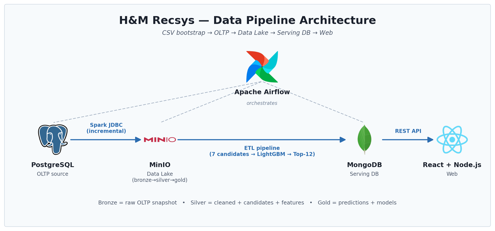

# H&M Personalized Fashion Recommendations



## 1. Bài toán

Dataset [H&M Personalized Fashion Recommendations](https://www.kaggle.com/competitions/h-and-m-personalized-fashion-recommendations) — với mỗi khách hàng, gợi ý **Top-12 sản phẩm** có khả năng mua cao nhất trong 7 ngày tới.

Hệ thống đi end-to-end theo pattern **Medallion** (Data Lake bronze → silver → gold), bao gồm:
- **OLTP** (PostgreSQL) — mô phỏng DB hãng bán lẻ: `articles`, `customers`, `transactions`.
- **Data Lake** (MinIO, S3-compatible) — bronze (raw snapshot) → silver (cleaned + candidates + features) → gold (predictions + models).
- **Pipeline ETL** (Airflow + Spark) — extract OLTP → clean → 7 candidate generators song song → union → feature engineering → LightGBM ranking → export Top-12.
- **Serving DB** (MongoDB) — cache Top-12 per user + global trending + age-group bestsellers.
- **Web** — Express API đọc thẳng MongoDB + React/Vite/Mantine UI.

```
CSV ──► PostgreSQL ──► MinIO (bronze → silver → gold) ──► MongoDB ──► Express/React
        (OLTP)         Spark + LightGBM (Airflow)         (serving)    (web)
```

### 6 nguồn ứng viên

| Strategy | Bắt pattern gì |
|---|---|
| Repurchase | Khách mua lại đồ cũ |
| Popularity | Bestseller 7 ngày gần nhất |
| Sibling | Biến thể cùng `product_code` |
| ALS (Spark MLlib) | Latent user/item factor |
| ItemCF | Co-occurrence + cosine similarity |
| Categorical | Gu (gender × group × colour) |

### Stack

| Layer | Tech |
|---|---|
| Source DB | PostgreSQL 15 |
| Data Lake | MinIO |
| Compute | Apache Spark 3.5 |
| Ranking | LightGBM 4.1 |
| Orchestration | Apache Airflow 2.10 |
| Serving DB | MongoDB 6 (+ Mongo Express UI) |
| Backend | Node.js + Express |
| Frontend | React + Vite + Mantine |
| Deploy | Docker Compose (single-node demo) |

## 2. Cài đặt

### Yêu cầu

- Docker Desktop ≥ 4.x (cấp ≥ 8GB RAM cho Spark/Airflow)
- Node.js ≥ 20 (chạy backend + frontend)
- Python 3.10+ (chỉ cần khi sinh demo subset từ CSV gốc)

### Lấy dataset

Tải 3 zip từ Kaggle về root project, giải nén:

```bash
mkdir -p data/raw
for f in articles.csv.zip customers.csv.zip transactions_train.csv.zip; do
  unzip -o "$f" -d data/raw/
done
```

### Sinh demo subset (~30MB, 12K users — đủ cho 1 lần chạy pipeline ngắn)

```bash
python3 -m venv .demo_venv
.demo_venv/bin/pip install pandas pyarrow

.demo_venv/bin/python bigdata/apps/sample_dataset.py \
    --raw_dir data/raw \
    --out_dir data/demo \
    --user_frac 0.02 \
    --since 2020-06-01

cp data/demo/*.csv data/raw/   # OLTP seed sẽ đọc từ đây
```

## 3. Chạy demo

Luồng demo có 3 phần độc lập:

```
(A) Bigdata stack (Airflow + Spark + Mongo + MinIO + OLTP)
        ↓ pipeline ghi user_recommendations vào MongoDB
(B) Backend Express (đọc Mongo, expose /api/...)
(C) Frontend Vite (gọi backend)
```

### A. Bigdata stack — Airflow chạy pipeline

```bash
cd bigdata
docker compose up -d --build
```

Đợi ~30s. Mở các UI:

| URL | Service | Login |
|---|---|---|
| http://localhost:8082 | **Airflow** UI | admin / admin |
| http://localhost:8083 | **Mongo Express** UI | admin / admin |
| http://localhost:8080 | Spark Master UI | — |
| http://localhost:8081 | Spark Worker UI | — |
| http://localhost:9001 | MinIO Console | minioadmin / minioadmin |
| postgresql://localhost:5433 | OLTP Postgres (`hm_oltp`) | hm / hm |
| mongodb://localhost:27017 | MongoDB (`hm_recsys`) | — |

**Trigger pipeline trên Airflow UI:**
1. Mở http://localhost:8082, login admin/admin
2. Bật toggle `recsys_pipeline_v1`
3. Click ▶ → **Trigger DAG**
4. Tab **Graph** để theo dõi 15 task (extract → clean → 7 candidate generators song song → union → feature_label → train_lightgbm → predict → export_to_mongo)

Pipeline mất ~10 phút trên demo subset. Khi xong, kiểm tra Mongo qua UI ở http://localhost:8083 (DB `hm_recsys` → collection `user_recommendations`) hoặc CLI:

```bash
docker compose exec mongodb mongosh hm_recsys --eval '
  print(db.user_recommendations.countDocuments() + " users");
  printjson(db.user_recommendations.findOne());
  printjson(db.pipeline_runs.find().sort({finished_at: -1}).limit(1).toArray());
'
```

### B. Backend Express

Backend kết nối thẳng tới Mongo ở `localhost:27017`. Lần đầu boot, nếu collection `articles` / `similar_products` / `cart_recommendations` trong Mongo còn trống, backend tự seed từ các file ở root (`article_metadata.csv`, `similar_products.json`, `cart_recommendations.json`).

```bash
cd backend
cp .env.example .env       # mặc định PORT=4100, MONGO_URI=mongodb://localhost:27017
npm install
npm run dev
```

Health check:
```bash
curl http://localhost:4100/health
curl http://localhost:4100/api/recommendations/trending
```

### C. Frontend Vite

```bash
cd frontend
npm install
npm run dev
```

Mở http://localhost:5173. UI sẽ:
- Trang chủ: lấy `personalized` recommendations cho customer ID đã chọn (lấy từ `user_recommendations` trên Mongo). Nếu user chưa có trong DB → fallback `trending`.
- Trang chi tiết: gọi `/products/:id/similar` → đọc từ `similar_products`.
- Giỏ hàng: POST `/api/recommendations/cart` → tính co-purchase từ `cart_recommendations`.

## 4. Schema MongoDB

```javascript
// user_recommendations (pipeline ghi)
{ _id: "<customer_id>", items: ["0817354001", ...], updated_at: ISODate }

// global_trending (pipeline ghi)
{ _id: "global", items: [...top 12...], updated_at: ISODate }

// age_bestsellers (pipeline ghi)
{ _id: "25-35" | "36-45" | ..., items: [...top 12...], updated_at: ISODate }

// pipeline_runs (pipeline ghi)
{ run_date, finished_at, user_count, global_count, age_groups }

// articles (backend seed từ article_metadata.csv)
{ _id: "<article_id>", name, type, price, imageFolder }

// similar_products (backend seed từ similar_products.json — output CLIP/ItemCF notebook)
{ _id: "<article_id>", items: ["<article_id>", ...] }

// cart_recommendations (backend seed từ cart_recommendations.json — output FPGrowth notebook)
{ _id: "<article_id>", items: ["<article_id>", ...] }
```

## 5. Pipeline DAG

```
wait_oltp_ready (Postgres sensor)
   └→ extract_oltp_to_minio (Spark JDBC → s3a://datalake/bronze)
        └→ step1_cleaning (Spark, bronze → silver)
             └→ [7 candidate scripts song song] (Spark)
             ├ candidate_repurchase    — Top-15 items mới mua gần nhất
             ├ candidate_popularity    — Top-30 bestseller 7 ngày
             ├ candidate_sibling       — Các biến thể cùng product_code
             ├ candidate_als           — Spark ML ALS (rank=32, implicit)
             ├ candidate_itemcf        — Co-occurrence + cosine
             ├ candidate_categorical   — Gu (gender × group × colour)
             └ candidate_fpgrowth      — FP-Growth association rules
                  └→ union_master (Spark)
                       └→ feature_label (Spark, 22 features)
                            └→ train_lightgbm (Python/lightgbm)
                                 └→ predict_lightgbm — Top-12 + fallback
                                      └→ export_to_mongo
                                           └→ notify_done
```

### Recall các nguồn ứng viên (demo subset)

| Strategy | Top-N | Recall@test |
|---|---|---|
| ALS | 40 | 0.0323 |
| Categorical | 40 | 0.0292 |
| ItemCF | 20 | 0.0290 |
| Sibling | 15 | 0.0276 |
| Repurchase | 15 | 0.0254 |
| Popularity | 30 | 0.0236 |
| **Master (union)** | ~97 / user | **0.0905** |

## 6. Cấu trúc thư mục

```
.
├── bigdata/                       # Pipeline (Spark + Airflow + Mongo + MinIO)
│   ├── apps/                      # Spark scripts + helper Python
│   │   ├── common.py
│   │   ├── sample_dataset.py
│   │   ├── step1_cleaning.py
│   │   ├── candidate_*.py         # 7 nguồn ứng viên
│   │   ├── union_master.py
│   │   ├── feature_label.py
│   │   ├── train_lightgbm.py
│   │   ├── predict_lightgbm.py
│   │   └── export_to_mongo.py
│   ├── dags/recsys_pipeline.py    # Airflow DAG
│   ├── docker-compose.yml         # Demo stack (single-node)
│   ├── docker-file.airflow.demo   # Airflow image custom
│   ├── oltp_init/                 # SQL bootstrap cho OLTP Postgres
│   └── notebooks/data/            # Notebook process_{articles,customer,transactions}
├── notebooks/                     # Notebook gốc trên Colab (research version)
│   ├── candidates/                # 6 nguồn ứng viên
│   └── models/                    # LightGBM, FPGrowth, CLIP
├── backend/                       # Node.js Express API
│   └── src/
│       ├── server.js
│       ├── lib/{mongo,dataStore,csv,imageUrl,unsplash}.js
│       └── routes/{recommendations,products}.js
├── frontend/                      # React + Vite UI
├── data/                          # raw CSV + cleaned + predictions
├── article_metadata.csv           # Backend seed nguồn (articles)
├── similar_products.json          # Backend seed nguồn (output notebook CLIP/ItemCF)
├── cart_recommendations.json      # Backend seed nguồn (output notebook FPGrowth)
└── global_trending.json           # Fallback trending nếu pipeline chưa chạy
```

## 7. Troubleshooting

| Lỗi | Nguyên nhân | Fix |
|---|---|---|
| Backend `MongoServerSelectionError: ECONNREFUSED 127.0.0.1:27017` | Mongo container chưa lên | `cd bigdata && docker compose up -d mongodb` |
| Backend bind port 4100 lỗi | Port đã bị chiếm (Firebase emulator default cũng :4000/:4100) | Đổi `PORT` trong `backend/.env` |
| `recsys_pipeline_v1` task `up_for_retry` mãi | Spark master URL sai | Restart container `airflow` sau khi sửa env |
| ALS task lỗi `No ratings available` | Filter time window không có data | Pipeline đã hardcode `--run_date 2020-09-22` để khớp dataset H&M |
| `libgomp.so.1: cannot open shared object file` | LightGBM thiếu OpenMP | Đã cài `libgomp1` trong image, rebuild với `--build` |

Logs từng task Airflow: UI → click task → tab **Logs**, hoặc:
```bash
docker compose exec airflow find /opt/airflow/logs/dag_id=recsys_pipeline_v1 -name '*.log' | tail
```

## Tham khảo

- Dataset: https://www.kaggle.com/competitions/h-and-m-personalized-fashion-recommendations
- Airflow Spark provider: https://airflow.apache.org/docs/apache-airflow-providers-apache-spark/
- LightGBM ranking: https://lightgbm.readthedocs.io/
